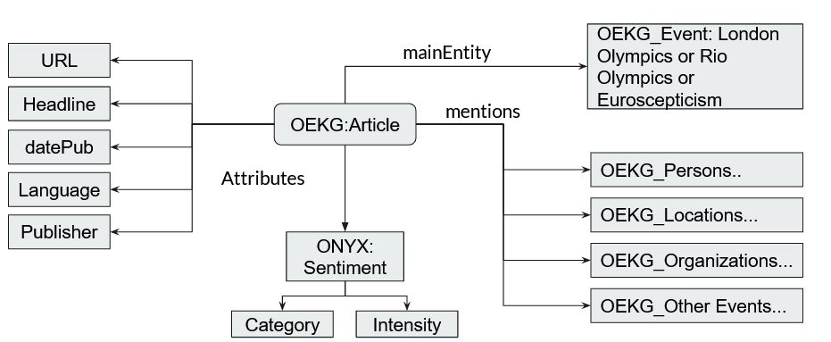

# Dataset Statistics

## Olympics
| **Publisher** | **Event** | **Articles** | **Events** | **Entities** |
|:-------------:|:---------:|:------------:|:----------:|:------------:|
| BBC | London | 204 | 373 | 2926 |
| BBC | Rio | 7 | 15 | 77 |
| Telegraph | London | 196 | 389 | 4941 | 
| Telegraph | Rio | 4 | 5 | 26 |
| TheGuardian | London | 217 | 412 | 4032 |
| TheGuardian | Rio | 41 | 126 | 1179 |
| Dailymail | London | 135 | 365 | 3436 |
| Dailymail | Rio | 9 | 25 | 148 |
| Estadao | London | 16 | 42 | 203 |
| Estadao | Rio | 120 | 309 | 2127 |
| Folha | London | 6 | 11 | 58 |
| Folha | Rio | 58 | 192 | 1234  |
| Globo | London | 20 | 53 | 329 |
| Globo | Rio | 246 | 556 | 4054 |
| **Total** | | **1279** |  |  |

## Euroscepticism
| **Publisher** | **Articles** | **Events** | **Entities** |
|:---------:|:--------:|:------:|:--------:|
| Elpais | 112 | 115 | 2802 |
| Elmundo | 216 | 207 | 4782 |
| TheGuardian | 187 | 161 | 4941 |
| Dailymail | 277 | 235 | 8528 |
| **Total** | **792** |  |  |

## Total Triples
Total Articles - 2071

Total Triples - 64528

# Rough Schema - Olympics and Euroscepticism

# Todo - Sample Queries and Responses

